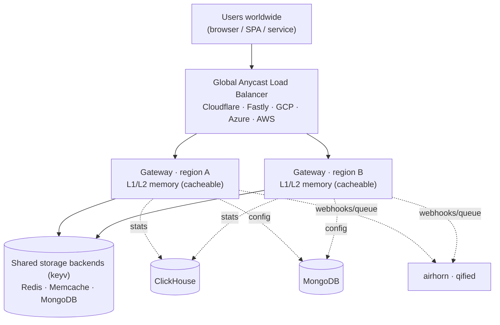

# Architecture

`http-cache` is built on a simple idea: **caching is an HTTP problem, so solve it with
HTTP architecture.** Run stateless gateways at the edge, put them behind a global
anycast load balancer, and let standard HTTP semantics do the heavy lifting.

## The big picture

A request flows like this:

1. A client (browser, SPA, or service) makes an HTTP request.
2. A **global anycast load balancer** routes it to the **nearest** gateway region.
3. The gateway checks its **L1/L2 in-memory cache** ([cacheable](/docs/caching-layers)).
   On a hit, it responds in microseconds.
4. On a miss, it consults the **shared storage backend** ([keyv](/docs/storage-backends))
   and, if needed, the origin — then populates its memory tiers.
5. Changes are pushed to subscribers over **socket.io** and fanned out to other systems
   via **webhooks and queues** ([airhorn](/docs/realtime-and-webhooks) + qified).
6. Every operation is recorded through the **statistics** provider framework
   ([ClickHouse](/docs/statistics) by default).

## Why not clustering?

Old-school cache clustering *sucks* — and we mean that technically:

- **O(n²) chatter.** Gossip and replication traffic grows with every node you add.
- **Rebalancing pain.** Adding or losing a node triggers reshuffling and risks
  split-brain and cache stampedes.
- **Sticky sessions.** You end up pinning clients to nodes to preserve cache affinity,
  which fights against horizontal scaling.
- **Single-region latency.** A cluster lives in one place, so distant users always pay
  a long round trip.

Clustering tries to make many machines pretend to be one big cache. That coupling is
exactly what makes it fragile.

## Why global load balancing + HTTP wins

`http-cache` gateways are **stateless** request handlers. Their memory tier is a local
accelerator, and the source of truth lives in a shared, provider-backed store. That
unlocks a far simpler operational model:

- **Nearest-edge latency.** Anycast routes each user to the closest region.
- **Elastic, no rebalancing.** Add or remove gateways freely — there is no cluster
  membership to negotiate.
- **No gossip, no sticky sessions, no split-brain.** Gateways never need to talk to
  each other to be correct.
- **HTTP all the way down.** CDNs, proxies, and clients already understand caching
  headers, so the whole ecosystem cooperates instead of fighting you.

## Diagram source (mermaid)

The diagram above is also maintained as mermaid for easy editing:

## Explore the pieces

- **[Storage backends](/docs/storage-backends)** — keyv providers.
- **[Caching layers](/docs/caching-layers)** — L1/L2 in memory with cacheable.
- **[Gateway & API](/docs/gateway-and-api)** — REST, gateway providers, and auth.
- **[Realtime & webhooks](/docs/realtime-and-webhooks)** — socket.io, airhorn, qified.
- **[Statistics](/docs/statistics)** — observability with ClickHouse.
