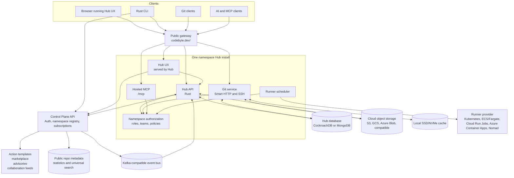
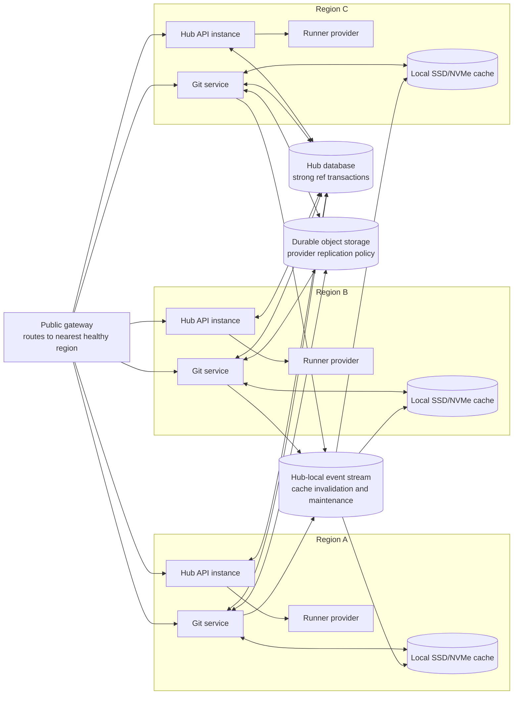
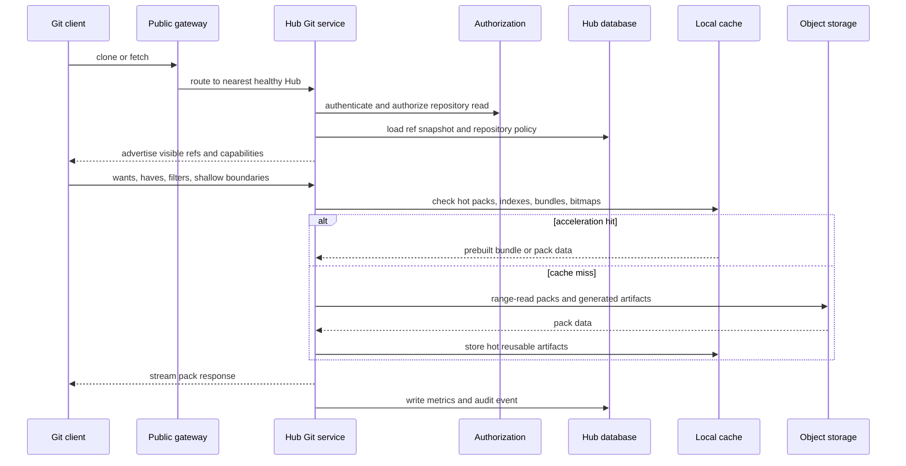
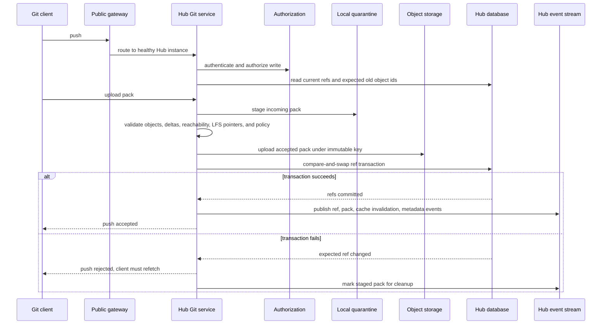

# codebyte

Modern Developer Hub.

Codebyte is a plan for a modern GitHub-class developer platform built around an installable Hub, a Control Plane, namespace-level isolation, cloud object storage, AI-native API access, and cloud-portable action execution.

## Table Of Contents

- [Why Build This](#why-build-this)
- [Architecture Thesis](#architecture-thesis)
- [Recommended UX Stack](#recommended-ux-stack)
- [High-Level Topology](#high-level-topology)
- [Architecture Diagrams](#architecture-diagrams)
- [Main Services](#main-services)
- [Rust Workspace](#rust-workspace)
- [API Surfaces](#api-surfaces)
- [API Versioning And Upgrades](#api-versioning-and-upgrades)
- [Hub And Namespace Model](#hub-and-namespace-model)
- [User Roles And Permissions](#user-roles-and-permissions)
- [Shared Subscriptions](#shared-subscriptions)
- [Provider Model](#provider-model)
- [Git Service And Storage Architecture](#git-service-and-storage-architecture)
- [Multiple Hub Instances](#multiple-hub-instances)
- [Scaling Plan](#scaling-plan)
- [Public Gateway](#public-gateway)
- [Threat Model](#threat-model)
- [Action Runner](#action-runner)
- [Rust CLI](#rust-cli)
- [Product Domains](#product-domains)
- [Implementation Milestones](#implementation-milestones)
- [Design Areas Still Needed](#design-areas-still-needed)
- [Reference Docs](#reference-docs)

## Why Build This

Developer platforms are now core infrastructure, but the dominant model was designed before object storage, cloud-native isolation, event streams, containerized build execution, and AI-native workflows became normal. Code hosting should be simpler to operate, easier to isolate, more portable across clouds, and built around APIs that serve both people and agents.

Codebyte starts from a different assumption: the Hub should be installable by anyone, own one namespace, and let the operator choose their cloud, object storage, runner platform, search backend, and event infrastructure. The Control Plane should provide the shared layer that makes those independent Hubs feel connected without taking ownership of their repository data or local execution policy.

Codebyte exists to explore a cleaner architecture:

- Treat each user or organization as an isolated Hub namespace instead of forcing every customer through one large multi-tenant core.
- Store Git data on durable cloud object storage instead of depending on local filesystem assumptions.
- Make the API, CLI, web app, Git protocol, and MCP surface first-class clients of the same domain model.
- Use Control Plane services for auth, namespace registration, discovery, and cross-hub coordination.
- Move shared platform features into event subscriptions so Hubs can stay independent while still receiving common templates, cross-hub collaboration signals, advisories, and marketplace updates.
- Run actions on standard container infrastructure so execution can move across Kubernetes, AWS, Google Cloud, Azure, and smaller providers.

## Architecture Thesis

Codebyte is split into independently operated Hubs and a shared Control Plane. A Hub is the installable product: one Hub serves one user or organization namespace and owns that namespace's repositories, metadata, secrets, policies, runners, storage configuration, and scaling profile. The Control Plane handles shared concerns like auth, namespace registration, discovery, subscriptions, and cross-hub activity so many independent Hubs can still behave like one connected platform.

Primary goals:

- Hub API written in Rust for Git, runners, projects, pull requests, issues, members, permissions, and namespace-local operations.
- Control Plane API written in Rust for auth, namespace registration, action templates, collaboration feeds, marketplace data, and shared subscription management.
- CLI written in Rust.
- Hub UX built as a modern TypeScript application backed by the Hub API and Control Plane API.
- REST and MCP interfaces for Hub operations, both backed by the same internal services, permissions, and audit model.
- Full Git compatibility so standard Git clients and existing clone, fetch, pull, push, branch, tag, and remote workflows work unchanged.
- Git storage backed by AWS S3, Google Cloud Storage, Azure Blob Storage, or S3-compatible object storage.
- One-namespace-per-Hub deployment instead of core multi-tenancy.
- Shared components delivered from the Control Plane through Kafka-compatible subscriptions.
- GitHub Actions-compatible runner that works across Kubernetes and cloud container services.
- Pluggable providers for object storage, runners, event streams, search, and cloud runtime choices.

## Recommended UX Stack

The best default UX stack for Codebyte is:

- TypeScript + React for the application shell and component model.
- Vite for development, builds, static asset generation, and optional SSR foundations.
- TanStack Router for typed routes, nested layouts, search params, and route loading.
- TanStack Query for server-state caching, mutations, invalidation, pagination, and background refresh.
- Tailwind CSS for systematized styling.
- Radix UI primitives plus shadcn/ui-owned components for accessible, customizable controls without locking the product into a black-box component library.
- OpenAPI-generated TypeScript client for REST contracts.
- Playwright for browser tests and Vitest for unit/component tests.

This is a better default than starting with a full Node metaframework because the Rust APIs are the source of truth. Hub UX should be served by each Hub install as a static or CDN-served shell, using Hub API for namespace-local data and Control Plane API for auth, namespace registration, shared subscriptions, and cross-hub activity. Add SSR only for public pages that need crawlability, previews, or faster first paint.

## High-Level Topology

```text
Hub UX      -> REST/SSE/WebSocket -> Hub API
Hub UX      -> REST               -> Control Plane API
Rust CLI    -> REST/Git/MCP       -> Hub API
Rust CLI    -> REST               -> Control Plane API
AI clients  -> MCP                -> Hub API
Git clients -> Smart HTTP/SSH     -> Hub API Git service

Hub API     -> Hub metadata database
Hub API     -> cloud object storage provider
Hub API     -> Search provider
Hub API     -> Runner provider
Hub API     -> Control Plane subscription client

Control Plane API -> Auth service
Control Plane API -> Namespace registry
Control Plane API -> Kafka-compatible event bus
Control Plane API -> Action templates, collaboration feeds, marketplace data,
               public repo metadata, universal search, audit subscriptions,
               advisory data

Public gateway -> codebyte.dev/<namespace-hub> -> registered Hub instance

Runner provider -> Kubernetes Jobs, ECS/Fargate, Cloud Run Jobs,
                   Azure Container Apps, Nomad, or another container runtime
```

## Architecture Diagrams

These diagrams show the intended product architecture, not final crate names or deployment manifests.

Overall system:



Multi-region Hub runtime:



Git fetch and clone path:



Git push and active/active ref update path:



## Main Services

Codebyte starts with three main services: Hub API, Hub UX, and Control Plane API.

Hub API:

- Written in Rust.
- Installed by anyone who wants to run a Codebyte Hub.
- Owns exactly one namespace.
- Controls Git, runners, projects, pull requests, issues, reviews, discussions, repository settings, namespace-local members, roles, permissions, secrets, policies, audit records, and artifacts.
- Uses Control Plane auth identities, but decides what those identities can do inside its namespace.
- Exposes REST, MCP, Smart HTTP Git, SSH Git, SSE/WebSocket streams, and action log streams.

Hub UX:

- Built with the recommended TypeScript stack.
- Served by each Hub install.
- Talks to Hub API for namespace-local product data.
- Talks to Control Plane API for auth, session state, namespace registration, shared subscriptions, cross-hub activity, mentions, notifications, marketplace data, action templates, public repository discovery, and universal search.
- Should continue to show cached namespace data and cached shared data when the Control Plane is temporarily unavailable.

Control Plane API:

- Written in Rust.
- Required at this stage for auth and namespace registration.
- Owns the auth system and namespace registry.
- Initially supports social login with GitHub and Google, plus passwordless email code login with 2FA enabled.
- Later adds passkeys, generic OIDC providers, and enterprise identity integrations.
- Publishes shared services: action templates, collaboration feeds, marketplace data, public repository metadata, universal search, advisory data, audit subscriptions, and cross-hub notifications.
- Makes many one-namespace Hub installs feel like one connected system.
- Does not own repository data, Git objects, issues, pull requests, runner execution, secrets, or namespace-local authorization.

## Rust Workspace

The Rust services should share a workspace with clear crates for domain logic, transport adapters, storage, events, and background workers.

Recommended starting shape:

- `hub-api`: Hub HTTP, MCP, Git, runner, and namespace-local service host using Axum, Tokio, Tower middleware, tracing, and OpenTelemetry.
- `control-plane-api`: Control Plane auth, namespace registration, shared service, and subscription service host.
- `domain`: repository, namespace, identity reference, collaboration, issue, pull request, action, and audit models.
- `rest`: REST routes exposed under `/api/v1`.
- `mcp`: Hub MCP server exposed over Streamable HTTP and usable by local bridges.
- `git`: Codebyte-owned Rust Git protocol, object, pack, ref, and storage library.
- `git-http`: Smart HTTP Git transport built on the Codebyte Git library.
- `git-ssh`: SSH Git transport built on the Codebyte Git library.
- `storage`: cloud object storage, metadata database, cache, and search adapters.
- `events`: Kafka-compatible producer and consumer abstractions.
- `runner`: action scheduling and provider integrations.
- `providers`: interfaces and implementations for object storage, runner, event stream, search, database, and cloud runtime choices.

REST should be described with OpenAPI from the first milestone. Hub MCP should expose the same permission model and domain operations as Hub REST, not a second business-logic layer.

## API Surfaces

Hub REST:

- Base path: `/api/v1`.
- OpenAPI contract checked in and used to generate SDKs.
- Stable resource model for the local namespace, repositories, refs, commits, trees, blobs, issues, pull requests, reviews, actions, artifacts, packages, members, teams, permissions, and audit events.
- SSE or WebSocket channel for live collaboration, action logs, notifications, and repository activity.

Hub MCP:

- Base path: `/mcp`.
- Hosted directly by every Hub API instance.
- Also exposed through the local CLI bridge with `codebyte mcp serve`.
- Resources for repositories, files, diffs, issues, pull requests, action logs, and audit records.
- Tools for creating branches, opening pull requests, commenting, reviewing, merging, dispatching actions, searching code, and querying project state.
- Prompts for code review, release notes, migration planning, incident summaries, and issue triage.
- Same auth, authorization, rate limits, audit logging, and policy checks as REST.

Control Plane REST:

- Base path: `/api/v1`.
- Auth, sessions, users, Control Plane identity, namespace registration, installation registration, shared subscriptions, marketplace data, public repository metadata, universal search, action templates, cross-hub notifications, mentions, collaboration feeds, advisories, and audit subscriptions.
- OpenAPI contract checked in separately from Hub REST.

Git:

- Smart HTTP and SSH endpoints for normal Git clients.
- Compatibility with standard Git clone, fetch, pull, push, branch, tag, ref advertisement, pack negotiation, shallow clone, partial clone, and Git LFS workflows.
- Cloud object storage for packfiles, loose objects, generated bundles, LFS objects, and archival snapshots.
- Transactional metadata for refs, permissions, locks, repository settings, and upload sessions.
- Optional local cache tier near Git compute for hot packs, commit graphs, and pack indexes.

## API Versioning And Upgrades

Codebyte should treat compatibility as a product feature. Hubs are independently operated, so the Control Plane, CLI, Hub API, Hub UX, MCP clients, event consumers, and database schema cannot assume every Hub upgrades at the same time.

Versioning rules:

- Every Hub release has an explicit semantic version.
- Every Hub registers its current version, supported API versions, database schema version, Git object layout version, and enabled provider versions with the Control Plane.
- REST APIs use stable major versions in the path, starting with `/api/v1`.
- REST additive changes are allowed within a major version. Breaking changes require a new major version.
- OpenAPI contracts are generated, checked in, and used for compatibility testing.
- MCP uses capability negotiation. Tools, resources, prompts, and protocol behavior must advertise names, versions, and required permissions.
- Event topics include schema versions. Consumers must tolerate unknown fields, and breaking event changes require a new schema version.
- CLI releases declare the Hub and Control Plane version ranges they support.
- Hub UX is served by each Hub, so the UX version should normally match the Hub API version it ships with.

Hub pinning:

- A Hub can pin to a specific release version or release channel.
- Release channels should include stable, preview, and long-term support channels once the project needs them.
- The Control Plane must continue supporting pinned Hubs within a documented compatibility window.
- A pinned Hub keeps its Hub UX, API behavior, database schema, Git object layout, and provider contracts stable until the operator upgrades.
- Control Plane subscription events must remain backward-compatible for pinned Hubs or provide versioned event streams.
- Gateway routing should respect the registered Hub version and never assume latest Hub behavior.
- Critical security updates can be marked required, but the system should still give operators a clear upgrade path instead of silently mutating Hub behavior.

Database upgrades:

- Each Hub owns its own database, so database upgrades happen per Hub, not globally.
- The Hub database stores a schema version and migration history.
- Migrations are provider-aware for CockroachDB and MongoDB.
- Migrations should be idempotent and safe to resume.
- Hub upgrade starts with a preflight check: database connectivity, current schema version, backup freshness, object storage access, provider compatibility, and available disk/cache space.
- Schema changes should prefer expand-and-contract migrations: add new fields/tables first, deploy compatible code, backfill data, then remove old fields in a later release.
- Destructive migrations require an explicit backup checkpoint and operator confirmation.
- Multi-instance Hubs coordinate migrations with a database lease so only one instance runs migrations.
- Hub instances that do not support the active schema version must refuse startup.
- Downgrade support must be explicit per release. If downgrade is not supported after a migration, the release notes must say so.
- Control Plane database upgrades follow the same migration discipline, but they are operated centrally and must preserve compatibility with pinned Hubs.

Git object layout upgrades:

- Git object layout versions are separate from database schema versions.
- Layout changes should be additive first and keep old objects readable.
- Background workers can rewrite or add acceleration data such as pack indexes, commit graphs, and bitmaps without changing Git compatibility.
- A Hub should not require rewriting all repository objects during a normal API upgrade.
- Compatibility tests must validate old repositories against new Hub versions before release.

Operator upgrade commands:

- `codebyte hub version`
- `codebyte hub pin <version-or-channel>`
- `codebyte hub upgrade plan`
- `codebyte hub upgrade apply`
- `codebyte hub migrate status`
- `codebyte hub migrate apply`

## Hub And Namespace Model

Each Hub install owns exactly one namespace. The Control Plane API registers namespaces and makes them discoverable, but it does not host namespace runtime data.

A Hub namespace owns:

- Its own metadata database.
- Repository metadata and Git object storage prefixes or buckets.
- Members, teams, roles, policies, deploy keys, namespace-local tokens, and secrets for that namespace.
- Action runner policies, artifact storage, caches, and logs.
- Database-backed search indexes for code, issues, pull requests, symbols, and audit records.
- Event subscriptions to shared services.

The Control Plane owns:

- Auth identities and sessions.
- Namespace registration.
- Hub installation registration.
- Cross-hub activity discovery, notifications, and mentions.
- Public repository metadata, statistics, and universal search indexes.
- Shared action templates, marketplace data, advisories, and subscription metadata.

The Hub runtime should be deployable independently. A Hub can scale, migrate, pause, back up, or restore without coordinating with every other Hub. The Control Plane gives the user a unified system view across Hubs.

## User Roles And Permissions

Control Plane identity proves who a user is. Hub permissions decide what that user can do inside a namespace. The Hub authorization engine should be shared by REST, MCP, Git HTTP, Git SSH, runner dispatch, and background jobs.

Namespace roles:

| Role | Scope | Actions |
| --- | --- | --- |
| Owner | Entire namespace | Manage namespace settings, transfer ownership, delete namespace, configure Hub providers, manage billing if added later, manage all members and teams, manage all repositories, configure public metadata publishing, configure audit retention, configure runners, manage secrets, configure policies, and perform all admin actions. |
| Admin | Entire namespace | Manage members and teams, create and archive repositories, manage namespace policies, manage runners, manage namespace-level secrets, configure public metadata publishing for repositories they administer, manage webhooks and integrations, and view audit logs. Cannot transfer or delete the namespace unless promoted to owner. |
| Member | Entire namespace | Create repositories if allowed by policy, participate in issues and pull requests, view internal namespace resources granted by teams or repository permissions, and use namespace-level features granted by policy. |
| Auditor | Entire namespace | Read audit logs, repository settings, membership, policy configuration, and security-relevant metadata. No write access to code, issues, pull requests, runners, or secrets. |
| Billing | Entire namespace | Reserved for later if billing and plan enforcement are added. No billing role is needed in the initial architecture. |

Repository roles:

| Role | Scope | Actions |
| --- | --- | --- |
| Repo Admin | One repository | Manage repository settings, visibility, branch protection, deploy keys, webhooks, repo secrets, action settings, public metadata publishing, collaborators, and deletion or archive requests depending on namespace policy. |
| Maintainer | One repository | Push branches, manage issues and pull requests, merge according to branch policy, manage labels and milestones, trigger actions, and publish releases. Cannot change security-sensitive repository settings unless granted by policy. |
| Write | One repository | Clone, fetch, push non-protected branches, open issues and pull requests, comment, review, trigger allowed actions, and upload artifacts through workflows. |
| Triage | One repository | Manage issues and pull requests without write access to code. Can label, assign, close, reopen, and manage project status. |
| Read | One repository | Clone, fetch, view code, view issues and pull requests, view action logs allowed by policy, and use read-only MCP tools. |
| Guest | One public repository | View public metadata and public README/search records through Hub or Control Plane discovery. No private data access. |

Team and token rules:

- Teams are namespace-local and can be assigned namespace roles, repository roles, or both.
- Deploy keys are repository-scoped by default and must be explicitly marked read/write.
- Namespace-local tokens inherit explicit scopes and should never imply owner access by default.
- Runner tokens are short-lived, job-scoped, and limited to the repository, commit, workflow, and permissions granted to that job.
- MCP sessions inherit the user's Hub permissions and require human approval for any state-changing tool call.
- Public repository metadata publishing can be enabled only by namespace owners and repository admins.

Sensitive actions:

- Namespace transfer requires the current owner to complete full 2FA and email verification, then the receiving owner must accept.
- Namespace deletion requires owner approval, 2FA, email verification, and a delayed execution window.
- Repository deletion requires repo admin or namespace admin approval, plus any namespace policy checks.
- Secret reads should not expose raw values after creation. Secret writes, rotations, and deletions must be audited.
- Branch protection, force-push policy, required reviews, and action policy changes must be audited.
- Git pushes must apply the same authorization and policy checks whether they arrive through HTTP or SSH.

## Shared Subscriptions

Shared platform features should use a Kafka-compatible event backbone. Redpanda, Apache Kafka, or managed Kafka-compatible services are all valid implementations if the producer and consumer contract stays portable.

Control Plane registration is required in the initial architecture for auth and namespace registration. Individual shared subscriptions should be selectable by each Hub install.

Example topics:

- `namespace.created`
- `namespace.updated`
- `namespace.deleted`
- `action_template.published`
- `action_template.deprecated`
- `collaboration.thread.updated`
- `marketplace.package.updated`
- `security.advisory.published`
- `public_repo.metadata.updated`
- `public_repo.stats.updated`
- `public_repo.search_index.updated`
- `audit.export.requested`

Hub installs subscribe only to the topics and partitions they need. Public Hubs can also publish sanitized public repository metadata, statistics, and search index records into the Control Plane so users can search and discover public repositories across Hubs. Shared data should be cached locally in the Hub and refreshed through events. Action templates should be cached without expiration, so existing workflows keep running if the Control Plane is down. If the shared bus is unavailable, existing Hub operations should continue wherever possible with the last known shared data.

Public repository metadata should include only discovery-safe data such as repository name, namespace, description, topics, language summaries, stars or equivalent activity metrics, public refs, default branch, license, README content, and timestamps. Universal search should index README and metadata only at first, not full source code. The Control Plane should not become the source of truth for public repository Git objects, issues, pull requests, secrets, permissions, or Hub-local policy.

## Provider Model

Hub should be installable by anyone and configurable for their infrastructure choices.

Initial provider interfaces:

- `ObjectStorageProvider`: AWS S3, Google Cloud Storage, Azure Blob Storage, MinIO, Cloudflare R2, Backblaze B2, and other S3-compatible targets.
- `RunnerProvider`: Kubernetes Jobs, ECS/Fargate, Cloud Run Jobs, Azure Container Apps, Nomad, and other container services.
- `EventProvider`: Kafka-compatible brokers, managed Kafka-compatible services, or local development adapters.
- `DatabaseProvider`: CockroachDB for PostgreSQL-compatible deployments and MongoDB for document-model deployments.
- `SearchProvider`: database-backed search using the selected Hub database provider first, with room for a dedicated search engine later if scale requires it.
- `LocalCacheProvider`: local NVMe, local SSD, attached SSD volume, RAM disk for small hot data, or development filesystem cache.
- `CloudRuntimeProvider`: deployment glue for AWS, Google Cloud, Azure, local Kubernetes, and smaller providers.

Each Hub gets its own database. Shared Control Plane services can register and discover Hubs, but they should not share one metadata database across Hub namespaces. Search should start inside that Hub database so metadata, issues, pull requests, code index records, symbols, and audit records stay namespace-local. Dedicated engines such as Tantivy or OpenSearch can be added later behind `SearchProvider` if database-backed search becomes a bottleneck.

## Git Service And Storage Architecture

The Git service is the hardest and most important part of Codebyte. It must be fully Git-compatible, active/active across Hub instances, backed by durable cloud object storage, and fast enough for large organizations, public repositories, CI systems, and large monorepos.

Codebyte should own its Git implementation as a Rust library. This is a large undertaking, but it is critical for long-term correctness, supportability, performance tuning, security fixes, and object-storage-native behavior. Existing Rust Git projects can be used as references or temporary test aids, but shelling out to system Git should not be the core implementation path.

Compatibility target:

- Smart HTTP and SSH Git transports.
- Git wire protocol v2 as the preferred protocol, with compatibility for normal Git clients.
- Pack protocol fetch and push behavior, including ref advertisement, negotiation, wants, haves, shallow boundaries, filters, sideband progress, and receive-pack status.
- Git pack, index, reverse index, multi-pack-index, commit-graph, reachability bitmap, bundle, and bundle URI formats where useful for compatibility and performance.
- Partial clone, shallow clone, sparse checkout compatibility, Git LFS, and large repository workflows.
- SHA-1 repositories first, with repository metadata designed for future SHA-256 object format support.

Rust crates:

- `git`: shared domain library for objects, object ids, refs, packs, deltas, commit graphs, reachability, validation, and repository layout.
- `git-http`: Smart HTTP transport and upload-pack/receive-pack handling.
- `git-ssh`: SSH transport and upload-pack/receive-pack handling.
- `git-lfs`: Git LFS pointer parsing, batch API, upload/download authorization, and object storage integration.
- `git-pack`: pack reader/writer, delta resolver, pack index writer, multi-pack-index support, bitmap support, and bundle writer.
- `git-refs`: ref snapshots, compare-and-swap transactions, reflog/audit records, branch protection checks, and policy hooks.
- `git-accelerator`: clone bundles, fetch bundles, commit graphs, reachability bitmaps, archive bundles, and hot-repository prewarming.
- `git-maintenance`: repack, compaction, verification, garbage collection, quarantine cleanup, and acceleration artifact regeneration.

Authoritative state:

- Hub database stores repositories, refs, ref versions, reflog/audit records, repository settings, branch protection, upload sessions, pack manifests, acceleration manifests, leases, and policy state.
- Cloud object storage stores immutable packfiles, loose objects if needed, LFS objects, bundles, archive bundles, commit graphs, indexes, bitmaps, and generated acceleration artifacts.
- Local SSD/NVMe stores disposable staging data, hydrated packs, indexes, commit graphs, bitmaps, temporary pack output, and hot repository caches.
- Hub-local event stream carries ref updates, pack commits, cache invalidations, acceleration artifact updates, maintenance leases, and replication state changes.

Storage model:

Git storage should be content-addressed and object-store-native, not a mounted filesystem pretending to be local disk. The storage layer must support AWS S3, Google Cloud Storage, Azure Blob Storage, and S3-compatible providers through native adapters. The storage architecture can be modern, but the external behavior must remain Git-compatible.

The fast path should use cloud object storage as durable storage and local SSD/NVMe as disposable cache and staging. Object storage is authoritative for immutable data. Local disk is required for performance, but never required for correctness.

Important design constraint: refs must be transactional even when object writes are eventually replicated. The object store can hold immutable data, but ref updates need compare-and-swap semantics.

Initial storage strategy:

- Store immutable Git objects, packfiles, LFS objects, and bundles in cloud object storage.
- Store refs, repository settings, upload sessions, locks, and pack metadata in the Hub's database.
- Use multipart uploads, resumable uploads, or block uploads depending on the object storage provider.
- Maintain commit graphs, pack indexes, and reachability bitmaps as generated cache artifacts.
- Use lifecycle rules for old temporary uploads, expired artifacts, and cold archives.
- Support object-store adapters for AWS S3, Google Cloud Storage, Azure Blob Storage, MinIO, Cloudflare R2, Backblaze B2, and other S3-compatible targets.
- Validate behavior against real Git clients and protocol test cases before adding Codebyte-specific features.

Fetch and clone path:

1. Gateway routes the client to the nearest healthy Hub instance.
2. Hub authenticates the request and resolves repository permissions through the shared authorization engine.
3. Hub creates a ref snapshot from the Hub database and advertises only refs the caller can see.
4. If the client and repository support acceleration, Hub advertises bundle URIs or serves a prebuilt clone/fetch bundle.
5. Hub negotiates wants, haves, shallow boundaries, and partial clone filters.
6. Pack planner chooses the fastest source: local cache, prebuilt acceleration artifact, object storage range reads, or a generated pack.
7. Hub streams the response without loading large packs, trees, blobs, or diffs fully into memory.
8. Metrics and audit records capture latency, bytes served, cache hits, authorization decisions, and protocol errors.

Push path:

1. Hub authenticates the pusher and checks repository write permissions.
2. Hub creates a ref snapshot and records the expected old object ids for every ref update.
3. Incoming pack data lands in local SSD/NVMe quarantine storage.
4. Hub validates object format, object ids, pack checksums, delta bases, reachability, LFS pointers, size limits, and policy constraints.
5. Hub runs branch protection, force-push policy, required review policy, and namespace/repository hooks.
6. Accepted packfiles are uploaded to cloud object storage under immutable keys and recorded as staged pack manifests.
7. Hub commits ref updates through Hub database compare-and-swap transactions using the expected old object ids.
8. On transaction success, pack manifests are promoted, reflog/audit records are written, and cache invalidation events are published.
9. On transaction failure, refs are unchanged and uploaded-but-unreferenced objects become garbage-collection candidates.
10. Background workers regenerate commit graphs, multi-pack indexes, bitmaps, bundles, archive artifacts, and public metadata/search records.

Active/active correctness:

- Any healthy Hub instance in any configured region can accept Git reads and writes.
- Ref updates are serialized by Hub database compare-and-swap transactions, not by a single regional writer.
- A ref update can commit only after the new objects are durably written and the pack manifest is recorded.
- Pack manifests should track object storage provider, key, checksum, size, object count, generation, state, and regional availability.
- If a region sees a ref before the corresponding objects are locally available, it must hydrate from object storage, wait for availability, or route the request to a healthy region that can serve the objects.
- All cache entries include content hashes or generation ids. Stale cache entries must be rejected by comparing against Hub database metadata.
- Events are at-least-once and handlers must be idempotent.
- Missing an event cannot break correctness; it can only cause cache misses or delayed acceleration.

Performance model:

- Public repositories get prebuilt clone and fetch acceleration artifacts by default.
- Hot private repositories get the same acceleration based on activity.
- Acceleration artifacts include clone bundles, fetch bundles, pack indexes, multi-pack indexes, commit graphs, reachability bitmaps, archive bundles, and shallow or partial clone metadata.
- Local SSD/NVMe cache auto-sizes from available disk and stores hot packs, indexes, bitmaps, commit graphs, and temporary generated packs.
- Pushes land in local SSD/NVMe staging first, where Hub validates packs, permissions, hooks, and policies.
- Accepted packs are uploaded to object storage, then refs are updated transactionally in the Hub database.
- Fetches and clones read from local SSD/NVMe cache first. On cache miss, Hub hydrates packfiles, indexes, commit graphs, and bitmaps from object storage.
- Object storage reads use provider-native range reads, parallelism, and immutable key layouts.
- Object keys should be distributed to avoid provider hot spots at high request rates.
- Pack generation should reuse existing pack data where possible and avoid recompressing objects on hot paths.
- Background workers compact loose objects into packs, generate commit graphs and bitmaps, prewarm hot repositories, and evict cold cache data.
- Cache directories can be deleted at any time. Hub must rebuild them from object storage and metadata.
- Commit graphs and changed-path metadata should accelerate history walks, merge-base checks, pull request diffs, and code navigation.
- Large monorepo operations must be streaming and resumable wherever possible.

Keeping instances in sync:

- Ref updates publish `git.ref.updated`.
- Pack promotions publish `git.pack.committed`.
- Acceleration changes publish `git.acceleration.updated`.
- Cache invalidations publish `git.cache.invalidate`.
- Public metadata updates publish `public_repo.metadata.updated` and `public_repo.search_index.updated`.
- Each Hub instance subscribes to Hub-local events and invalidates local cache by repository id, ref generation, pack generation, or acceleration artifact id.
- Workers use Hub database leases so repack, bitmap generation, bundle generation, indexing, and cleanup are not duplicated unsafely.

Maintenance and verification:

- Quarantine cleanup removes failed or abandoned push data.
- Garbage collection removes unreachable object storage keys only after ref, reflog, retention, replication, and audit windows allow it.
- Repository verification checks pack checksums, object ids, indexes, reachability, LFS object availability, and ref integrity.
- Background maintenance should be incremental and pauseable so large repositories do not block normal Git traffic.
- Every generated artifact must be disposable and rebuildable from authoritative Hub database and object storage state.

## Multiple Hub Instances

A Hub install can run multiple Hub API instances for the same namespace and should support multi-region active/active deployment from day one. Instances share authoritative state and keep only disposable state locally.

Shared state:

- Hub database for refs, repository metadata, locks, upload sessions, action jobs, and scheduler leases.
- Cloud object storage for immutable Git data, LFS objects, artifacts, caches, and generated repository acceleration data.
- Hub-local event stream for cache invalidation, live updates, action logs, and background worker coordination.

Replica behavior:

- Any Hub API instance can serve REST, MCP, Git fetch, and Git clone requests.
- Any healthy Hub API instance in any configured region can accept writes.
- A Git push is handled by one instance for the life of the connection, but correctness does not depend on sticky routing.
- Ref updates use compare-and-swap transactions so two instances cannot silently overwrite the same ref.
- Active/active writes must use the Hub database and Git storage engine as the consistency boundary, not regional assumptions.
- Long-running background work uses database leases so multiple workers do not compact, index, or schedule the same job twice.
- Each instance keeps its own local SSD/NVMe cache. Cache invalidation is event-driven, and cache misses hydrate from object storage.
- If an instance dies during a push, its uncommitted local staging data can be discarded because refs were not advanced.
- If an instance dies after uploading immutable objects but before advancing refs, cleanup workers can garbage-collect unreachable objects later.

## Scaling Plan

Codebyte should expect large organization Hubs with many repositories, users, workflows, and public traffic. The scaling model should stay simple at the namespace boundary: one Hub, one namespace, one Hub database, one cloud object storage configuration, and many active Hub instances across selected regions.

Hub database scaling:

- One Hub namespace maps to one Hub database.
- A namespace cannot be split across multiple Hub databases.
- Scaling should come from the selected database provider, cloud object storage, local cache, background workers, and operational tuning.
- CockroachDB and MongoDB providers must support the selected multi-region topology for the Hub.
- The database should store refs, repo metadata, permissions, issues, pull requests, action state, leases, audit indexes, and search metadata.
- Heavy data stays out of the database: Git packs, LFS objects, artifacts, logs, caches, bundles, and generated acceleration data.

Multi-region active/active:

- Multi-region Hub instances are the default.
- Hub operators select the regions where the Hub runs. Defaults should be based on the operator's current region or expected user region.
- The public gateway routes users to the nearest healthy Hub instance and fails over automatically.
- Git reads, REST, MCP, Hub UX, and eligible background work can run in any healthy region.
- Git writes and ref updates are active/active from day one, but they must go through strongly consistent compare-and-swap transactions.
- The Git/storage engine must be designed for active/active correctness across Hub instances, regions, local caches, and durable object storage.
- Object storage must use provider-native replication or an equivalent replication strategy across selected regions.
- Regional local caches are disposable and never determine correctness.

Object storage key layout and hot repositories:

- Object keys should be immutable, content-addressed where possible, and distributed to avoid provider hot spots.
- Mutable state such as refs, locks, and upload sessions belongs in the Hub database.
- Public repositories should get prebuilt clone and fetch acceleration artifacts.
- Hot private repositories can also receive acceleration artifacts based on activity.
- Acceleration artifacts are derived cache, not source of truth, and must never bypass authorization.
- Useful artifacts include clone bundles, pack indexes, multi-pack indexes, commit graphs, reachability bitmaps, archive bundles, and shallow or partial clone acceleration metadata.
- Background workers regenerate acceleration artifacts after pushes and publish cache invalidation events.

Cache warming and eviction:

- Hub cache should auto-size based on available local disk.
- Operators may add min/max cache bounds later, but the default should be automatic.
- Each Hub instance and region keeps its own local SSD/NVMe cache.
- Cache synchronization should use event-driven invalidation, generation ids, and content-addressed keys instead of trying to make every cache identical.
- If an instance misses an invalidation event, it must validate cache generation against Hub database metadata before serving cached data.
- Hot repositories should be prewarmed after pushes and frequent fetches.
- Cache misses are acceptable; stale cache reads are not.

Large monorepo support:

- Large monorepo support is an MVP requirement.
- The Rust Git library must support streaming behavior and avoid loading whole repositories, large trees, or large diffs into memory.
- Required Git capabilities include partial clone, shallow clone, sparse checkout compatibility, Git LFS, commit graphs, reachability bitmaps, multi-pack indexes, and efficient pack negotiation.
- Code browsing must be path-based and progressive.
- Diffs and pull requests should support async generation, file count limits, diff size limits, generated-file detection, and progressive rendering.
- Actions checkout should support sparse and partial fetch behavior.
- Search indexing must resume after failure and handle large file counts.

Scaling pressure points:

- The main risks are hot repositories, clone/fetch fanout, large pull requests, action log volume, search indexing backlog, and audit/event write volume.
- Observability should track cache hit rate, clone/fetch latency, push latency, ref conflicts, object storage latency, database latency, worker lag, action queue depth, and gateway failover events.

## Public Gateway

Hub UX is served by each Hub install. The Control Plane registers each namespace and the reachable Hub endpoints, but it does not host the Hub UX.

Later, Codebyte should add a public proxy or gateway in front of `codebyte.dev`. The gateway routes `codebyte.dev/<namespace-hub>` to the correct registered Hub instance.

Gateway responsibilities:

- Resolve namespace-to-Hub routing through the Control Plane namespace registry.
- Route users to the nearest healthy Hub instance and fail over automatically.
- Forward browser, REST, Git Smart HTTP, and hosted MCP traffic to the correct Hub where appropriate.
- Preserve Hub ownership of runtime data, authorization policy, Git storage, runners, and local UX assets.
- Support custom domains and private/internal Hubs later.
- Cache nothing initially. The gateway should resolve and forward traffic without storing repository data, secrets, static assets, or routing metadata.

## Threat Model

The threat model should be designed before implementation begins. Codebyte has several high-risk boundaries: public internet traffic, Git protocol traffic, MCP tools, untrusted workflow execution, cloud object storage, the Hub database, the Control Plane registry, and the public gateway.

Primary assets to protect:

- Git objects, refs, LFS objects, releases, packages, and artifacts.
- Hub database records for repositories, issues, pull requests, members, permissions, runner jobs, tokens, and audit events.
- Secrets used by actions, deploy keys, namespace-local tokens, session tokens, and short-lived OIDC credentials.
- Control Plane identities, sessions, namespace registration records, routing metadata, shared subscriptions, public repository metadata, and universal search indexes.
- MCP tools and resources that can read or mutate Hub state.
- Runner infrastructure, logs, caches, network access, and artifact upload credentials.

Trust boundaries:

- Browser, CLI, Git client, AI/MCP client, webhook sender, and public gateway to Hub API.
- Hub API to Hub database, object storage, event stream, local cache, and runner provider.
- Hub API to Control Plane API for auth, registration, shared subscriptions, and public metadata publication.
- Control Plane API to identity providers, event bus, public metadata indexes, and gateway routing data.
- Runner job container to host runtime, cloud metadata service, secrets, network, caches, artifacts, and repository checkout.
- Public gateway to registered Hub endpoints.

Hub API threats:

- Broken authorization between Control Plane identity and Hub-local permissions.
- Repository permission bypass through REST, MCP, Git Smart HTTP, or SSH.
- Ref update races, force-push policy bypass, and inconsistent hook enforcement.
- User-content attacks through markdown, diffs, rendered files, issue comments, releases, and artifacts.
- Webhook abuse, SSRF, request smuggling, path traversal, and cache poisoning.
- Token leakage through logs, errors, URLs, redirects, and artifacts.

Control Plane threats:

- Account takeover through social login, passwordless email code abuse, 2FA bypass, or session theft.
- Namespace takeover through registration, ownership transfer, gateway routing, or stale DNS/custom-domain records.
- Subscription poisoning through malicious action templates, marketplace data, advisories, or collaboration feed events.
- Public repository metadata poisoning, spam, ranking abuse, stale search results, and removal-request failures.
- Over-collection of Hub-local data that should remain inside the Hub.

Runner threats:

- Malicious workflow code exfiltrating secrets, tokens, source code, artifacts, caches, or cloud credentials.
- Container breakout, privilege escalation, host filesystem access, or reuse of dirty workspaces.
- Unsafe network egress to internal services, cloud metadata endpoints, or private dependencies.
- Untrusted remote `uses:` actions, mutable tags, dependency confusion, and compromised action templates.
- Log injection, secret masking failures, and artifact tampering.

MCP threats:

- AI client invoking destructive tools without user intent or sufficient approval.
- Prompt injection through repository files, issues, pull requests, action logs, or public metadata.
- Tool permission confusion between read-only, write, admin, and runner-dispatch capabilities.
- Data exfiltration through broad resources, search, diffs, logs, or audit exports.
- Missing audit trail for MCP tool calls and resource reads.

Git over SSH/HTTP threats:

- Auth bypass across clone, fetch, push, LFS, and ref advertisement.
- Protocol parser bugs, oversized packs, decompression bombs, and object corruption.
- Pack negotiation abuse, shallow or partial clone edge cases, and denial-of-service on hot repositories.
- SSH key misuse, deploy-key scope confusion, and credential replay.
- Inconsistent behavior between HTTP Git, SSH Git, REST, and MCP authorization.

Public gateway threats:

- Incorrect namespace-to-Hub routing.
- Host header, path traversal, open redirect, cache poisoning, and request smuggling.
- Leakage of private Hub routes or private namespace existence.
- Stale routing after namespace transfer, suspension, deletion, or endpoint rotation.
- TLS, custom domain, and private/internal Hub exposure mistakes.

Initial security requirements:

- One authorization engine shared by REST, MCP, Git HTTP, Git SSH, and action dispatch.
- Signed, short-lived tokens between Control Plane, Hub, gateway, CLI, and runners.
- Event signatures and schema versions for Control Plane subscription data.
- Deny-by-default runner filesystem and token permissions, isolated ephemeral workspaces, scoped secrets, and open network egress with logging.
- Mandatory audit records for auth events, permission changes, Git writes, MCP tool calls, runner dispatches, secret reads, and gateway routing changes.
- Hub audit logs should retain 12 months by default and be configurable at the Hub level.
- Control Plane audit logs should retain 12 months by default.
- Compatibility and fuzz testing for Git protocol parsing, pack handling, webhook parsing, and MCP inputs.
- Clear separation between authoritative Hub data and Control Plane public metadata indexes.

Threat model decisions:

- Public repository metadata publishing can be enabled only by namespace owners and repository admins.
- Universal public search indexes README and repository metadata only at first.
- MCP tool calls that make any change require human approval before execution.
- Runner network egress is open with logging because runners execute in the operator's own cloud environment.
- Namespace ownership transfer must be initiated by the current namespace owner with full 2FA and email verification, then accepted by the receiving owner.
- Gateway caching is disabled initially.
- Hub audit log retention defaults to 12 months and is configurable per Hub.
- Control Plane audit log retention defaults to 12 months.

Threat model decisions still needed:

- Remote action trust policy should prioritize developer experience while still helping users avoid unsafe mutable actions.
- Custom-domain verification details still need to be designed.
- Should private/internal Hubs be reachable through `codebyte.dev`, or only through direct/private routes?

## Action Runner

Actions should be compatible with GitHub Actions workflows while remaining portable across container platforms.

Compatibility goals:

- Support `.codebyte/workflows/*.yml` and `.yaml` workflow files using GitHub Actions-compatible syntax.
- Support common GitHub Actions triggers, jobs, steps, expressions, matrix builds, contexts, environment variables, secrets, artifacts, caches, summaries, and logs.
- Support `uses:` for local actions, reusable workflows, and remote actions from GitHub-compatible sources.
- Match GitHub Actions behavior closely enough that most existing workflows run without modification.
- Clearly document intentional differences where exact compatibility is not possible or not desirable.

Runner architecture:

- Hub API scheduler receives workflow jobs.
- Provider interface launches an ephemeral container job.
- Providers implement Kubernetes Jobs first, then ECS/Fargate, Cloud Run Jobs, Azure Container Apps, and Nomad.
- Hub operators select the regions where runners can execute; defaults should be based on the operator's current region or expected user region.
- Jobs receive short-lived OIDC identity, scoped repository token, secrets, cache mounts, and artifact upload credentials.
- Logs stream back through Hub API.
- Artifacts and caches use cloud object storage.
- Filesystem and token permissions are deny-by-default.
- Network egress is open with logging by default because jobs run in the operator's own cloud environment.

Action templates should be shared through Control Plane subscriptions, mirrored into Hub, and retained indefinitely if the Control Plane is unavailable. Execution policy is Hub-local.

## Rust CLI

The CLI should be a first-class Rust application, not a thin wrapper over shell commands.

Recommended crates and responsibilities:

- `clap` for command parsing.
- `reqwest` or `hyper` for REST calls.
- Codebyte's Rust Git library for Git-aware local operations where direct Git behavior is needed.
- `serde` for API models generated from the OpenAPI contract.
- `keyring` or platform-native credential storage for auth tokens.

Initial commands:

- `codebyte auth login`
- `codebyte hub register`
- `codebyte hub status`
- `codebyte repo create`
- `codebyte repo clone`
- `codebyte pr create`
- `codebyte pr checkout`
- `codebyte pr review`
- `codebyte action run`
- `codebyte action logs`
- `codebyte mcp serve`

## Product Domains

Hub-owned domains:

- Repositories, refs, commits, trees, blobs, and releases.
- Issues, pull requests, reviews, discussions, and notifications.
- Actions, runners, artifacts, caches, templates, and secrets.
- Packages and container registry.
- Webhooks, integrations, and MCP tools.
- Search, code navigation, symbols, and dependency intelligence.
- Namespace-local members, teams, roles, policies, audit, compliance exports, and enforcement.

Control Plane-owned domains:

- Auth identities and sessions.
- Namespace and Hub installation registration.
- Cross-hub discovery, notifications, mentions, and collaboration feeds.
- Public repository metadata, statistics, and universal search.
- Shared action templates, marketplace data, advisory feeds, audit subscriptions, and subscription metadata.

## Implementation Milestones

1. Architecture records and contracts
   - Rust workspace layout.
   - Hub OpenAPI skeleton.
   - Control Plane OpenAPI skeleton.
   - Hub MCP resource/tool map.
   - API, MCP, event, CLI, Hub pinning, and database migration versioning policy.
   - Hub, namespace, and Control Plane registration data model.
   - Namespace and repository role model.
   - CockroachDB and MongoDB metadata provider contracts.
   - Codebyte Rust Git library architecture.
   - Git object-store design note.
   - Multi-region active/active scaling and cache invalidation design.

2. Control Plane and Hub registration MVP
   - Control Plane auth with GitHub social login, Google social login, passwordless email code login, and 2FA.
   - Register one Hub installation for one namespace.
   - Provision or attach one database for the Hub.
   - Provision or attach object storage for the Hub.
   - Hub UX sign-in through the Control Plane.
   - Hub API validates the Control Plane identity and applies Hub-local membership.

3. Hub-local repository MVP
   - Create repository.
   - Implement first Codebyte Rust Git library slice for objects, refs, packs, and Smart HTTP.
   - Support large monorepo primitives: partial clone, shallow clone, sparse checkout compatibility, LFS, commit graphs, bitmaps, and multi-pack indexes.
   - Push and fetch through Git Smart HTTP.
   - Store Git objects in AWS S3, Google Cloud Storage, Azure Blob Storage, or S3-compatible object storage.
   - Read refs, commits, trees, and blobs through REST.
   - Expose hosted Hub MCP at `/mcp` and local MCP through `codebyte mcp serve`.
   - Generate prebuilt clone/fetch acceleration artifacts for public and hot repositories.

4. UX and CLI MVP
   - React/Vite app shell.
   - Repository browser.
   - Commit, tree, blob, and diff views.
   - Rust CLI auth, Hub registration, repo, and PR basics.

5. Collaboration MVP
   - Issues.
   - Pull requests.
   - Review comments.
   - Hub-local notifications.
   - Control Plane cross-hub activity, mentions, and notifications.
   - Live updates.

6. Actions MVP
   - GitHub Actions-compatible workflow parser.
   - Core GitHub Actions contexts, expressions, triggers, jobs, steps, matrix, secrets, artifacts, caches, and logs.
   - Kubernetes provider.
   - Control Plane action template subscription flow.
   - Non-expiring local action template cache.

7. Shared services
   - Namespace and Hub installation catalog.
   - Kafka-compatible event bus.
   - Shared action template publishing.
   - Marketplace and advisory subscriptions.
   - Public repository metadata, statistics, and universal search subscriptions.

8. Public gateway
   - Route `codebyte.dev/<namespace-hub>` to the correct registered Hub instance.
   - Preserve Hub-served UX as the source of the application shell.
   - Support browser, REST, Git Smart HTTP, and hosted MCP routing where appropriate.

## Design Areas Still Needed

Control Plane:

- Behavior when the Control Plane is unavailable.
- Hub registration lifecycle states such as pending, active, suspended, and deleted.
- Public repository metadata ingestion, freshness, ranking, abuse prevention, and removal requests.
- Gateway routing health checks and failover.

Product surface:

- Webhooks and app integrations.
- Package and container registry scope.
- Fine-grained custom roles beyond the initial namespace and repository roles.
- Notification preferences and cross-hub mentions.
- Accessibility and keyboard-first UX.

## Reference Docs

- React: https://react.dev/learn/describing-the-ui
- Vite: https://vite.dev/guide/
- TanStack Router: https://tanstack.com/router/latest/docs/framework/react/guide/type-safety
- TanStack Query: https://tanstack.com/query/docs/docs
- Radix UI: https://www.radix-ui.com/primitives/docs/overview/introduction
- shadcn/ui: https://ui.shadcn.com/docs
- Axum: https://docs.rs/axum
- OpenAPI: https://spec.openapis.org/oas/latest
- MCP: https://modelcontextprotocol.io/specification/2025-11-25/server/resources
- Git protocol v2: https://git-scm.com/docs/gitprotocol-v2
- Git pack protocol: https://git-scm.com/docs/gitprotocol-pack
- Git HTTP protocol: https://git-scm.com/docs/gitprotocol-http
- Git pack format: https://git-scm.com/docs/gitformat-pack
- Git partial clone: https://git-scm.com/docs/partial-clone
- Git bundle URI: https://git-scm.com/docs/bundle-uri
- Git bundle format: https://git-scm.com/docs/gitformat-bundle
- Git commit graph format: https://git-scm.com/docs/commit-graph-format
- Git multi-pack index: https://git-scm.com/docs/multi-pack-index
- Git update-ref transactions: https://git-scm.com/docs/git-update-ref
- Git SHA-256 transition: https://git-scm.com/docs/hash-function-transition
- Git LFS specification: https://github.com/git-lfs/git-lfs/blob/main/docs/spec.md
- Apache Kafka: https://kafka.apache.org/intro/
- Amazon S3: https://docs.aws.amazon.com/AmazonS3/latest/userguide/Welcome.html
- Amazon S3 performance: https://docs.aws.amazon.com/AmazonS3/latest/userguide/optimizing-performance-guidelines.html
- Google Cloud Storage consistency: https://cloud.google.com/storage/docs/consistency
- Google Cloud Storage request rates: https://cloud.google.com/storage/docs/request-rate
- Azure Blob Storage performance targets: https://learn.microsoft.com/en-us/azure/storage/blobs/scalability-targets
- Azure Blob Storage performance checklist: https://learn.microsoft.com/en-us/azure/storage/blobs/storage-performance-checklist
- Kubernetes Workloads: https://kubernetes.io/docs/concepts/workloads/
